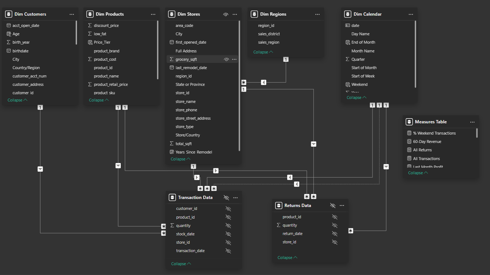

# About This Project

Maven Market is a multinational grocery chain with locations in Canada, Mexico, and the United States. Your task is to connect and transform the source data, build a relational data model, create calculated columns and measures, and design a report using various visualizations.

## Loading and Shaping the Data

To start the project, I uploaded all the CSV files into Power BI and used the Power Query Editor to shape the data. I reviewed each data table to ensure the accuracy of all data types. In the Power Query Editor, I created new columns such as full name, birth year, has children (conditional column), discount price (calculated column), average retail price (using the Group By function), full address (calculated column using merge), area code, start of week, day name, start of month, month name, quarter, and year. I replaced all null values in the datasets with zeros and combined the 1997 and 1998 datasets through a connected folder. I updated all date fields to the MM/DD/YYYY format using the Modeling tab and formatted prices and costs as currency. Finally, I set all store fields as geographical locations.

## Data Model Creation

In the Relationships View, I established connections between the transaction data and the customers, products, and stores lookup tables using primary and foreign keys. I linked the transaction data to the calendar lookup table through both active and inactive relationships. For the return data, I connected it to the products, calendar, and stores tables using primary and foreign keys, and organized the stores data with the regions lookup table in a snowflake schema.

After connecting all the tables, I ensured that the relationships were properly set as one-to-many, with filters flowing downstream from the lookup tables to the primary data table. I also verified that all connections were made through shared lookup tables, avoiding any direct links between the data tables themselves. I also added a Measures table to keep my measures organized in one place.



## Creating Calculated Columns and Measures

In Data View, I created the following calculated columns and measures:

``` /* In the Calendar table, add a column named "Weekend"
Equals "Y" for Saturdays or Sundays (otherwise "N") */

Weekend = 
IF (
    WEEKDAY([Date], 2) > 5, 
    "Y", 
    "N"
    )

/* In the Calendar table, add a column named "End of Month". Returns the last date of the current month for each row */

End of Month = 
EOMONTH([Date], 0)

/* In the Customers table, add a column named "Current Age".
Calculates current customer ages using the "birthdate" column and the TODAY() function */

Age =
DATEDIFF ( 'Dim Customers'[birthdate], TODAY (), YEAR )


/* In the Customers table, add a column named "Priority"
Equals "High" for customers who own homes and have Golden membership cards (otherwise "Standard") */

Priority =
IF (
    'Dim Customers'[homeowner] = "Y"
        && 'Dim Customers'[member_card] = "Golden",
    "Priority",
    "Standard"
)

/* In the Customers table, add a column named "Short_Country"
Returns the first three characters of the customer country, and converts to all uppercase */

Short_Country = 
UPPER (
     LEFT('Dim Customers'[Country/Region], 3)
)

/* In the Customers table, add a column named "House Number"
Extracts all characters/numbers before the first space in the "customer_address" column */

House Number =
LEFT (
    'Dim Customers'[customer_address],
    SEARCH ( " ", 'Dim Customers'[customer_address] ) - 1
)


/* In the Products table, add a column named "Price_Tier"
Equals "High" if the retail price is >$3, "Mid" if the retail price is >$1, and "Low" otherwise */

Price_Tier =
IF (
    'Dim Products'[product_retail_price] > 3,
    "High",
    IF ( 'Dim Products'[product_retail_price] > 1, "Mid", "Low" )
)

/* In the Stores table, add a column named "Years_Since_Remodel"
/* Calculates the number of years between the current date (TODAY()) and the last remodel date */

Years_Since_Remodel = 
DATEDIFF('Dim Stores'[first_opened_date],TODAY(),YEAR)
```

In the Reports view, I added key metrics including quantity sold, quantity returned, total transactions, total returns, return rate, weekend transactions, overall transactions, overall returns, total revenue, total cost, and total profit. I also incorporated unique products, year-to-date revenue, 60-day revenue, last month's transactions, revenue, profit, and returns, along with the revenue target.

```

Quantity Sold = 
SUM('Transaction Data'[quantity])

Quantity Returned =
SUM('Returns Data'[quantity])

/* Create new measures named "Total Transactions" and "Total Returns" to calculate the count of rows from each data table
Spot check: You should see 269,720 transactions and 7,087 returns */

Total Transactions = COUNTROWS('Transaction Data')
Total Returns = COUNTROWS('Returns Data')

/* Create a new measure named "Return Rate" to calculate the ratio of quantity returned to quantity sold (format as %)
Spot check: You should see an overall return rate of 0.99% */

Returns Rate = 
            DIVIDE([Quantity Returned],[Quantity Sold],0)

/* Create a new measure named "Weekend Transactions" to calculate transactions on weekends
Spot check: You should see 76,608 total weekend transactions */

Weekend Transactions = 
                    CALCULATE(
                    [Total Transactions],
                    'Dim Calendar'[Weekend] = "Y"
)

/* Create a new measure named "% Weekend Transactions" to calculate weekend transactions as a percentage of total transactions (format as %)
 Spot check: You should see 28.4% weekend transactions */

% Weekend Transactions = DIVIDE([Weekend Transactions],[Total Transactions])

/* Create new measures named "All Transactions" and "All Returns" to calculate grand total transactions and returns (regardless of filter context). Spot check: You should see 269,720 transactions and 7,087 returns across all rows (test with product_brand on rows) */

All Returns = CALCULATE(
			[Total Returns],
			ALL('Transaction Data')
		)

All Transactions = CALCULATE(
			[Total Transactions],
			ALL('Transaction Data')
		)

/*Create a new measure to calculate "Total Revenue" based on transaction quantity and product retail price, and format as $ (hint: you'll need an iterator)
Spot check: You should see a total revenue of $1,764,546  */

Total Revenue = 
SUMX(
    'Transaction Data',
    'Transaction Data'[quantity] * RELATED('Dim Products'[product_retail_price])
)

/* Create a new measure to calculate "Total Cost" based on transaction quantity and product cost,
 and format as $ (hint: you'll need an iterator) Spot check: You should see a total cost of $711,728 */

Total Cost = 
SUMX(
    'Transaction Data',
    'Transaction Data'[quantity] * RELATED('Dim Products'[product_cost])
)

/* Create a new measure named "Total Profit" to calculate total revenue minus total cost, and format as $. 
Spot check: You should see a total profit of $1,052,819 */

Total Profit = [Total Revenue] - [Total Cost]

/* Create a new measure to calculate "Profit Margin" by dividing total profit by total revenue calculate total revenue (format as %)
Spot check: You should see an overall profit margin of 59.67% */

Profit Margin = 
DIVIDE(
    [Total Profit],
    [Total Revenue]
    )

/* Create a new measure named "Unique Products" to calculate the number of unique product names in the Products table
Spot check: You should see 1,560 unique products */

Unique Products = 
DISTINCTCOUNT('Dim Products'[product_name])

/* Create a new measure named "YTD Revenue" to calculate year-to-date total revenue, and format as $
Spot check: Create a matrix with "Start of Month" on rows; you should see $872,924 in YTD Revenue in September 1998 */

YTD Revenue = CALCULATE(
			[Total Revenue],
			DATESYTD('Dim Calendar'[Date])
		)

/* Create a new measure named "60-Day Revenue" to calculate a running revenue total over a 60-day period, and format as $
Spot check: Create a matrix with "date" on rows; you should see $97,570 in 60-Day Revenue on 4/14/1997 */

60-Day Revenue = CALCULATE(
			[Total Revenue],
			DATESINPERIOD(
				'Dim Calendar'[date],
				MAX('Dim Calendar'[date]),
				-60,
				DAY
			)
		)

/* Create new measures named  "Last Month Transactions", "Last Month Revenue", "Last Month Profit", and "Last Month Returns"
Spot check: Create a matrix with "Start of Month" on rows to confirm accuracy */

// Last Month Transactions
Last Month Transactions = CALCULATE(
			[Total Transactions],
			DATESINPERIOD(
				'Dim Calendar'[date],
				MAX('Dim Calendar'[date]),
				-30,
				DAY
			)
		)
// Last Month Revenue
Last Month Revenue = CALCULATE(
			[Total Revenue],
			DATESINPERIOD(
				'Dim Calendar'[date],
				MAX('Dim Calendar'[date]),
				-30,
				DAY
			)
		)

// Last Month Profit
Last Month Profit = CALCULATE(
			[Total Profit],
			DATESINPERIOD(
				'Dim Calendar'[date],
				MAX('Dim Calendar'[date]),
				-30,
				DAY
			)
		)

// Last Month Returns
Last Month Returns = CALCULATE(
			[Total Returns],
			DATESINPERIOD(
				'Dim Calendar'[date],
				MAX('Dim Calendar'[date]),
				-30,
				DAY
			)
		)


/* Create a new measure named "Revenue Target" based on a 5% lift over the previous month revenue, and format as $
Spot check: You should see a Revenue Target of $99,223 in March 1998 */

Revenue Target = VAR PrevMonth =
		CALCULATE(
			[Total Revenue],
			DATEADD(
				'Dim Calendar'[date],
				-1,
				MONTH
			)
		)
		RETURN
			PrevMonth * 1.05

```
